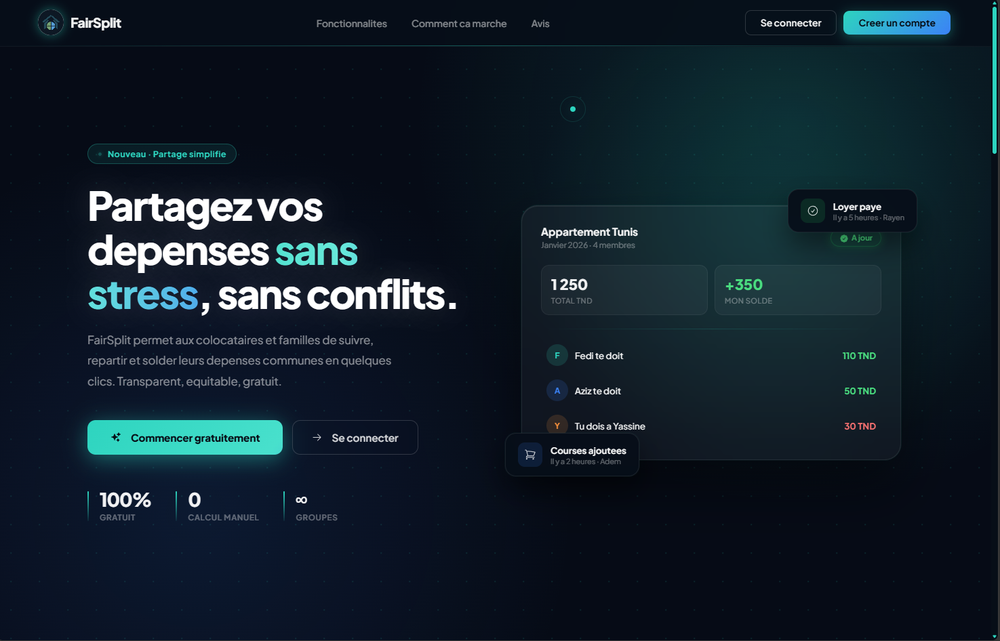

<div align="center">

# FairSplit

**Application web moderne pour la gestion des depenses partagees entre amis, famille ou colocataires.**


</div>

---

## Presentation

**FairSplit** est une application web full-stack permettant de gerer les depenses partagees au sein d'un groupe. Elle offre un suivi en temps reel des dettes, une repartition automatique des soldes, et une experience utilisateur fluide grace a des animations soignees et un systeme d'onboarding interactif.

> **Note** : FairSplit est optimise pour les ordinateurs de bureau. La version mobile est en cours de developpement.

---

## Apercu

### Landing Page


### Dashboard


### Bloc version mobile


---

## Fonctionnalites

- **Gestion de groupes** - Creez des groupes, invitez des membres, suivez les depenses collectives
- **Calcul automatique des soldes** - Repartition intelligente des dettes sans calcul manuel
- **Temps reel** - Notifications et mises a jour instantanees via Socket.io
- **Authentification securisee** - Inscription, connexion et recuperation de mot de passe par email (JWT + bcrypt)
- **Export PDF** - Generation de rapports financiers detailles avec jsPDF
- **Onboarding interactif** - Visite guidee par page avec tooltips animes (Framer Motion + Heroicons)
- **Demandes d'achats** - Systeme de gestion de demandes entre membres d'un groupe

---

## Stack technique

### Frontend

| Technologie | Role |
|---|---|
| React 19 | Bibliotheque UI principale |
| Vite | Build ultra-rapide |
| React Router DOM | Navigation SPA |
| Framer Motion | Animations fluides |
| Socket.io-client | Notifications temps reel |
| React Joyride | Onboarding interactif |
| jsPDF + jspdf-autotable | Export rapports PDF |
| Heroicons & React Icons | Iconographie |

### Backend

| Technologie | Role |
|---|---|
| Node.js + Express.js | Serveur & API REST |
| MongoDB + Mongoose | Base de donnees |
| Socket.io | Communication temps reel |
| JWT + bcryptjs | Authentification securisee |
| Resend | Envoi d'emails (recuperation de mot de passe) |
| dotenv | Variables d'environnement |
| Nodemon | Rechargement automatique en dev |
| ESLint | Qualite du code |

---

## Systeme d'onboarding (Joyride)

La logique est centralisee dans `OnboardingTour.jsx`. Le systeme fonctionne de deux manieres :

### Automatique

Lance automatiquement a la premiere connexion d'un nouvel utilisateur. La progression est sauvegardee via `localStorage` (cle `fair_split_tour_disabled`) pour respecter le choix de l'utilisateur.

### Manuel (icone ?)

Declenchable depuis le `Header.jsx` via l'icone **?**. Detecte la page courante via `useLocation` et lance le tour correspondant :

| Page | Contenu du tour |
|---|---|
| Dashboard | Explication des KPIs financiers (Solde net, On te doit, etc.) |
| Depenses | Ajout de depenses et gestion des remboursements |
| Groupes | Gestion des membres, codes d'invitation, frais recurrents |
| Historique | Navigation dans les archives de transactions |
| Parametres | Gestion du profil utilisateur |

### Personnalisation avancee

- **Tooltip personnalise** - Design entierement refait avec Framer Motion, dark mode natif
- **Icones contextuelles** - Chaque etape affiche une icone Heroicons correspondant au sujet
- **Redirection intelligente** - Si l'utilisateur n'a pas de groupe, une etape speciale propose un bouton de redirection vers la creation de groupe

---

## Prerequis

Avant de commencer, assurez-vous d'avoir installe :

- **Node.js** v18 ou superieure
- **npm** (inclus avec Node.js)
- **MongoDB** - instance locale ou cluster [MongoDB Atlas](https://www.mongodb.com/atlas)

---

## Installation & demarrage

### 1. Cloner le depot

```bash
git clone https://github.com/votre-username/fairsplit.git
cd fairsplit
```

### 2. Configurer le backend

```bash
cd serv
npm install
```

Creez un fichier `.env` dans le dossier `serv/` (basez-vous sur `.env.example`) :

```env
PORT=5000
MONGO_URI=votre_url_mongodb
JWT_SECRET=votre_secret_jwt
JWT_EXPIRE=7d
NODE_ENV=development
FRONTEND_URL=http://localhost:3000
RESEND_API_KEY=votre_cle_api_resend
RESEND_FROM_EMAIL=votre_email_expediteur
```

Lancez le serveur :

```bash
npm run dev
```

### 3. Configurer le frontend

```bash
cd ../client
npm install
npm run dev
```

L'application sera accessible sur **http://localhost:5173**.

---

## Structure du projet

```
FairSplit/
├── screenshots/          # Captures d'ecran
│   ├── landing.png
│   ├── dashboard.png
│   └── mobile.png
├── client/               # Frontend React
│   └── src/
│       ├── api/          # Appels API
│       ├── context/      # Etat global (Auth, Toasts...)
│       ├── components/   # Composants reutilisables
│       └── pages/        # Vues / routes
└── serv/                 # Backend Node.js
    ├── models/           # Schemas MongoDB (Mongoose)
    ├── routes/           # Definition des routes API
    ├── controllers/      # Logique metier
    └── middleware/       # Auth, gestion d'erreurs
```

---

> (c) 2026 FairSplit Inc. - Tous droits reserves.
