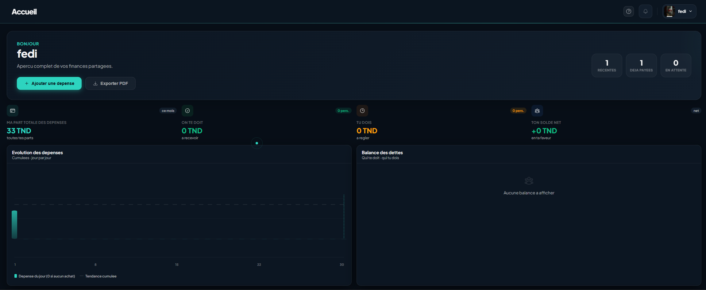

# FairSplit

<p align="center">
  Application web moderne pour la gestion des dépenses partagées
</p>

<p align="center">
  
  
  
  
</p>

---

## Présentation

FairSplit est une application web permettant de gérer efficacement les dépenses entre plusieurs utilisateurs.  
Elle facilite le suivi des dettes, la gestion des groupes et la répartition des paiements avec une mise à jour en temps réel.

---

## Aperçu de l’application

<!-- Remplace ces images par tes propres captures -->


---

## Fonctionnalités

- Gestion des groupes
- Ajout et suivi des dépenses
- Calcul automatique des soldes
- Notifications en temps réel
- Authentification sécurisée
- Réinitialisation du mot de passe par email
- Export des données en PDF
- Onboarding utilisateur interactif

---

## Stack technique

### Frontend
- React 19
- Vite
- React Router DOM
- Framer Motion
- Socket.io-client

### Backend
- Node.js
- Express.js
- MongoDB avec Mongoose
- Socket.io
- JSON Web Token (JWT)
- bcrypt

### Outils
- Nodemon
- ESLint

---

## Architecture

```bash
FairSplit/
│
├── client/
│   ├── src/
│   │   ├── api/
│   │   ├── context/
│   │   ├── components/
│   │   └── pages/
│
├── serv/
│   ├── models/
│   ├── routes/
│   ├── controllers/
│   └── middleware/